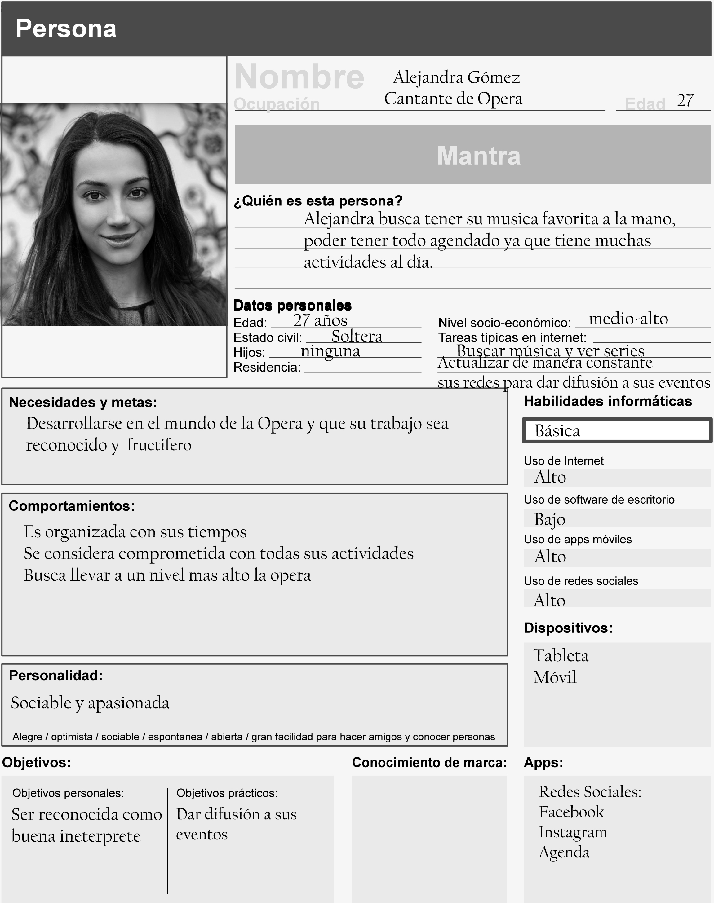

# CUSTOMER JOURNEY
## User persona (cantantes de opera)

Antes

Para mi un cantante de opera es aquella persona que debe tener mucha elegancia, una voz muy grave, normalmente son personas ya mayores, deben tener mucha disciplina y cuidado de su voz, me imagino que por lo mismo deben cuidar su alimentación.

Después

No necesariamente para ser un cantante de opera se debe ser mayor, ya que hay niños que se dedican a esta profesión.

El ser cantante opera exige mucho, demanda tiempo y energía, por lo mismo muchos cantantes deben sacrificar el estar con su familia, lamentablemente esta profesión no tiene una gran demanda ya que hace mucha falta difusión de la misma, se debe romper con los estereotipos de que es solo para gente de élite y que es aburrida, al contrario hay gran cantidad de eventos con costos muy bajos que tienen como propósito incluir a toda la población pero les hace falta difusión.

No por ser cantantes de opera deben escuchar pura música relacionada con la opera, es decir no por cocinar hamburguesas solo comerás estas, los cantantes de operas están muy catalogados de diferentes maneras, lamentablemente esto mismo pasa con muchas otras cosas, tratemos de evitarlo y conocer antes de hacernos de ideas erróneas.

